## Desenvolvedor Full Stack | PHP/Laravel | Node.js | React | MySQL | MongoDB - Lucas Rocha

---

## GitHub Stats

  
  

---

## Sobre Mim

Sou Desenvolvedor Backend com foco em PHP/Laravel e no ecossistema JavaScript/Node.js/React.js. Atualmente atuo na Secretaria de Tecnologia e Inovação desenvolvendo soluções backend em Laravel, além de possuir experiência com desenvolvimento de sistemas web completos e aplicações sob demanda como freelancer.

Tenho foco no desenvolvimento de APIs RESTful, gerenciamento de bancos de dados, sistemas financeiros, dashboards administrativos, automações e plataformas de gestão de conteúdo e eventos.

* **Atuação Atual:** Desenvolvedor Backend na Secretaria de Tecnologia e Inovação (desde Julho de 2026).
* **Formação:** Graduando em Análise e Desenvolvimento de Sistemas (Previsão de conclusão: 2027.1).
* **Projetos:** Sistemas de gestão, dashboards financeiros, automação de documentos com IA, ranking de atletas e Landing Pages de alta conversão.

---

## Tecnologias e Ferramentas

### JavaScript

  
  
  
  

 

### PHP

  
  
  

 

### Bancos de Dados

  
  

 

### Ferramentas & Práticas

  
  
  
  
  

---

## Experiência Profissional e Projetos

### Secretaria de Tecnologia e Inovação — Prefeitura
**Desenvolvedor Backend** *(Julho de 2026 – Presente)*
* Atuação na construção, manutenção e refatoração de sistemas web internos e serviços utilizando Laravel.

### Federação Pernambucana de Kickboxing e Muay Thai
**Desenvolvedor Full Stack (Freelance)**
* Desenvolvimento do sistema completo de gestão de filiados, conteúdos e eventos esportivos.
* Criação de algoritmo de cálculo e atualização automática de ranking de atletas e dashboard administrativo.

### J Pacífico Refrigeração
**Desenvolvedor Full Stack (Freelance)**
* Módulo de gerenciamento financeiro corporativo integrado a um dashboard de relatórios.
* Criação de Landing Page institucional otimizada para captura de clientes.

> **Outras Soluções Desenvolvidas:** Além dos sistemas acima, possuo experiência no desenvolvimento de automações de geração de certificados e carteirinhas em PDF integradas a Inteligência Artificial, diversos sistemas internos governamentais e Landing Pages focadas em conversão.

---

## Habilidades Profissionais

* Organização e planejamento estruturado de código
* Foco na resolução prática de problemas e requisitos de negócio
* Trabalho colaborativo e comunicação eficiente com equipes multidisciplinares
* Capacidade de rápida adaptação e aprendizado de novas tecnologias

---

<blockquote align="center">
  
"Porque Deus amou o mundo de tal maneira que enviou o seu filho unigênito para que todo aquele que nele crê não pereça, mas tenha a vida eterna" — <strong>João 3:16</strong>

</blockquote>
